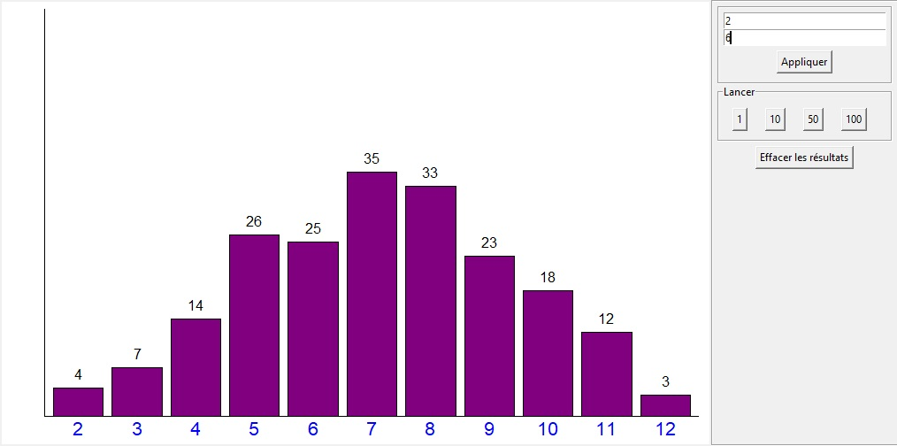
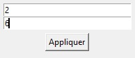

# Python-Dice-Proba

This is a program that can simulation dice rolls.
## Features
- Histogram view of the result
- Possibility to set number of dices and number of dice faces
- Possibility to launch various numbers of simulations with one click
## Installation
1. Download the repository by clicking on `Code > Download ZIP`
2. Extract the ZIP file
3. Run `main.pyw`
## Requirements
- Python 3.7
- Python `tkinter` library
- Python `random` library
## Usage
You can change dice settings using this section :

- The first line is the number of dices
- The second line allow you to change the number of faces of the dices

You can launch 1, 10, 50 or 100 simulations at once using this section :

